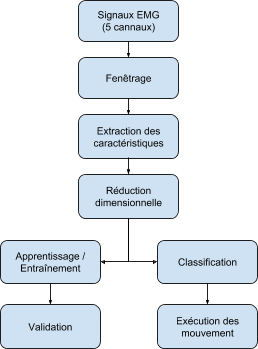

# Main
Prothèse myoélectrique de la main : comparaison entre SVM et CNN

## Repository Organisation
* **datasets**: empty folder, plase download our datasets in the google drive folder, if you have access, and place then inside this folder. Sorry for not sharing this here, but our volunteers weren't asked for the permission of sharing this data.
* **doscs**: not so important... figures, schemas, and references for this and others .md files.
* **Firmware**: Arduino Sketchs for acquiring and simulating signals.
* **python-hand-movements-classifier**: Offline classifier for validate our strategy and tests some ML variations.
* **python-real-time-application**: GUI for managing real time acquisition, classification and control of the prothesis.

## Objective
But: Créer un modèle de prothèse myoélectrique de la main fonctionnelle pour comparer deux paradigme de traitement de signal: Réseaux de neurones artificielles (CNN) et machine à vecteur de support (SVM).

## Description
Pour cela nous imprimerons et construirons le modèle d’avant bras open-source mis à disposition par Gaël Langevin[1]. Cet outil aura pour vocation d’être, non seulement, le support de nos tests et démonstrations, mais aussi de servir à de futures applications conçus par les futurs élèves ingénieurs de Polytech Lyon. De même nous nous servirons du circuit EMG conçu par Rônaldo Sena Lima Filho[2] pour créer un circuit imprimé d’EMG 5 canaux. Ainsi nous pourrons nous concentrer sur l’acquisition d’une base de donnée d’apprentissage ainsi que la programmation de deux modèles de traitement du signal que nous voulons comparer MVS ( Machine à Vecteur de Support) et RNA (Réseaux de Neurones Artificiel). (Nous avons déjà à disposition une base de données des signaux EEG bruts en relations avec certains mouvements pour pouvoir commencer à entraîner nos algorithmes - fournis par Eber Lawrence Souza Gouveia [3]).

Pour assurer une comparaison juste nous utiliserons un unique langage de programmation, notre choix s’est arrêté sur le Python. Nous allons comparer les deux modèles sur la rapidité et l’efficacité lors de l’apprentissage et sur les performances en temps réel.

**Processus prévisionnelle de fonctionnement du projet**



## Sources
1. Langevin, Gaël. InMoov. [En ligne] http://inmoov.fr/.
2. Filho, Rônaldo Sena Lima. EMG. uberlândia : s.n.
3. Gouveia, Eber Lawrence Souza. DataBase Biolab. Uberlândia : s.n., 2018.


## Authors and License
```
"THE BEER-WARE LICENSE" (Revision 42):
Gaeton, Italo, Theotim and Samuel wrote this codes.
As long as you retain this notice you can do whatever you want with this stuff.
If we meet some day, and you think this stuff is worth it,
you can buy us a beer (or even a Coffee) in return.
```
* Gaetan Davout
* Ítalo G. Sampaio Fernandes
* Theotim Lucas
* Samuel Bonneau
